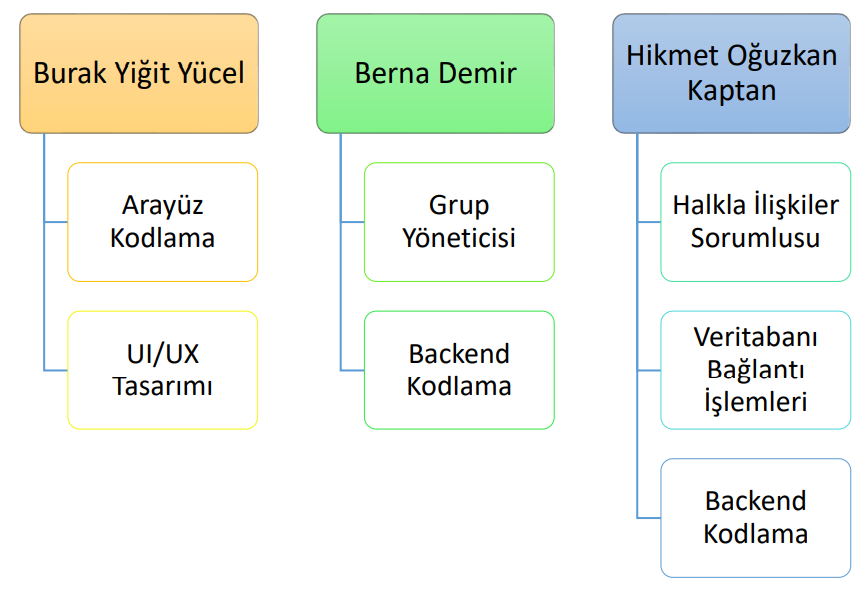
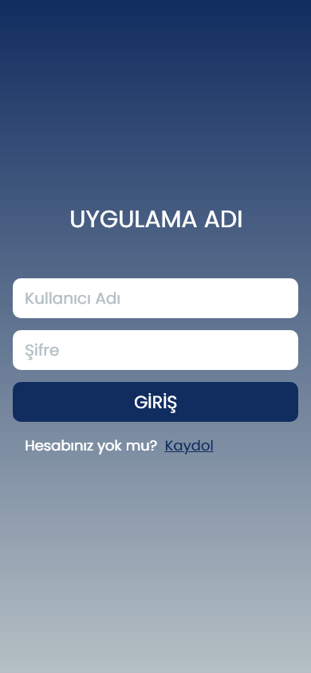
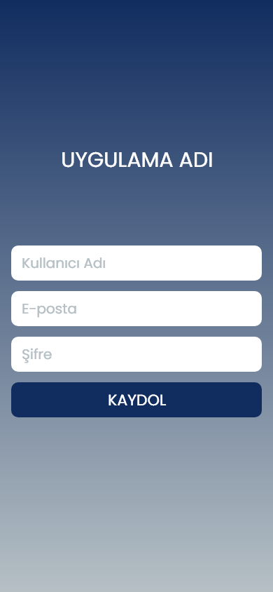
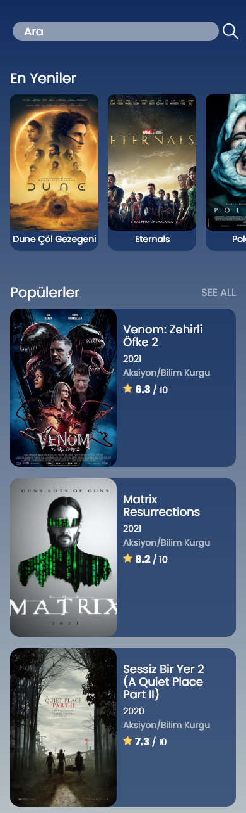
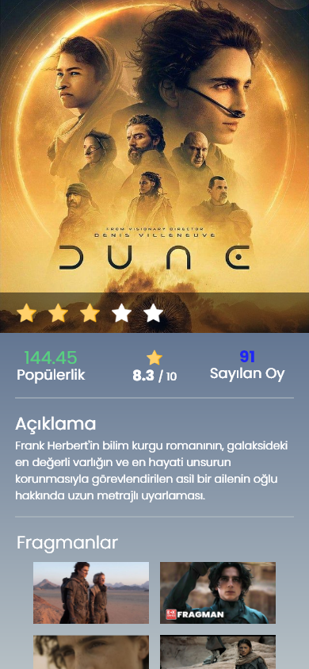
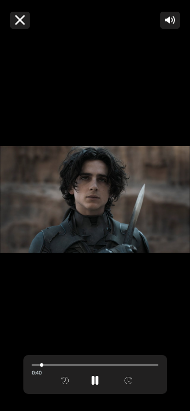
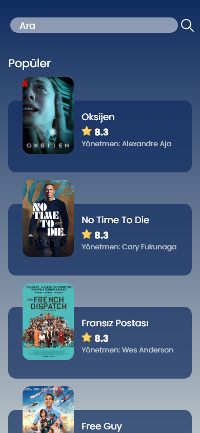

# Film Fragman Mobil Uygulamasi
# Konu
Projenin konusu, kullanıcıların istedikleri film için fragman, yorum ve puan gibi bilgilere ulaşmalarını sağlamak ve isterlerse kendi görüşlerini paylaşmalarına olanak sağlamaktır. Gerçekleştireceğimiz uygulama ile kullanıcıların kolaylıkla film hakkında fikir sahibi olmaları ve bu sayede izlemek istedikleri filme karar vermeleri amaçlanmaktadır.  
 
# Kapsam
Projenin kapsamında insanlara istedikleri film hakkında fragman, yorum ve puan görüntüleme veya yazma imkanı sunmak amaçlanmaktadır. Projede arayüz tasarımı ve backend tarafı flutter programlama dili ile hazırlanacak olup Visual Code editörü kullanılacaktır. Projenin arayüzünün kullanıcılar tarafından kolaylıkla kullanılabilir ve sade olması planlanmaktadır. Arkaplanda SQLite veritabanı yönetim sistemi kullanılacak olup, kullanıcılara ait bilgilerin (kullanıcı kaydı, yorumları, puanlamaları gibi…) burada saklanması planlanmaktadır. Proje üyeleri sürüm kontrolünü Github üzerinden gerçekleştirecek olup, proje görev paylaşımları ve planlaması Jira ile yapılacaktır.  
 
# Gorev Dagilimi
 
# Tasarim
  
 
  

